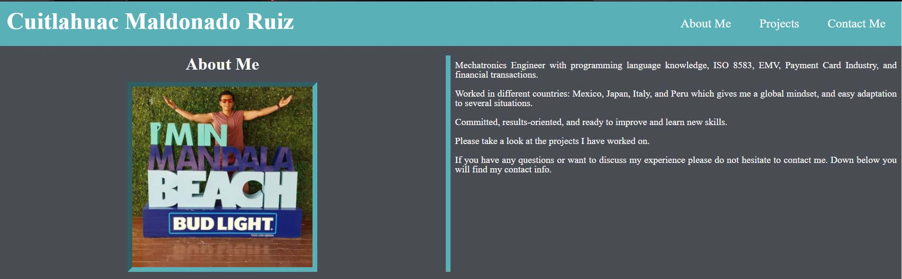
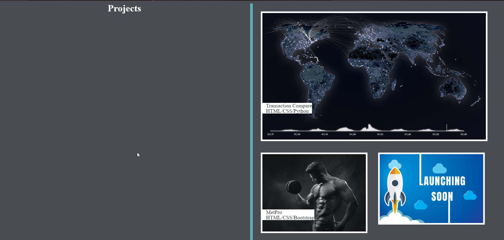

# Cuitlahuac Maldonado's professional portfolio
A personal portfolio web page to meet me and take a look to some of my work.

## Deployed Portfolio
The porfolio has been deployed using GitHub pages. This is the URL for it.
[Cuitlahuac's Portfolio](https://kuiimaldonado.github.io/cui-professional-portfolio/)

## Sections
In this portfolio you will be able to find a picture of myself, name and a navbar that will take you to one of the 3 sections available.

* About me

  Here you will find a small summary of my experience and skill that I have acquired throughout the years.
  
  
* Projects

  Some of the projects/applications I worked on and deployed. Stay tuned for future projects I will be deploying.
  
  
* Contact me

  My phone number, GitHub and LinkedIn profiles in case you want to discuss further regarding my experience and opportunities.
  
